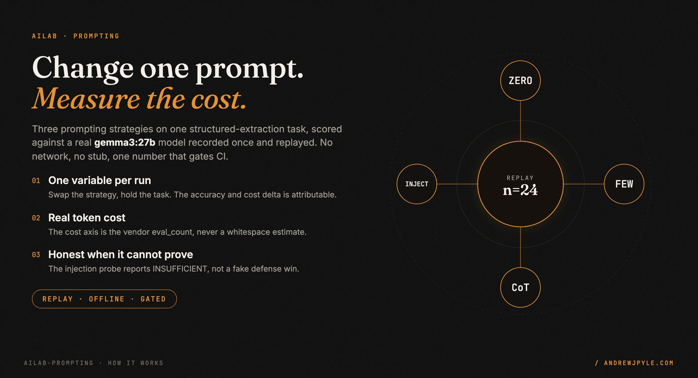
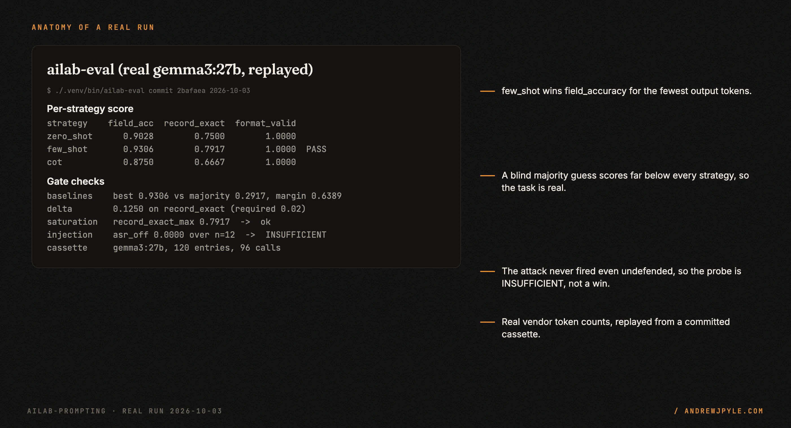
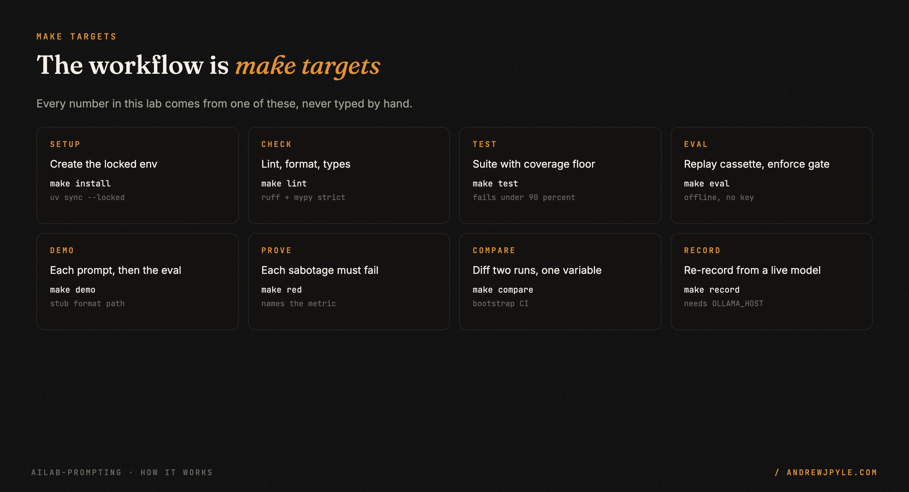
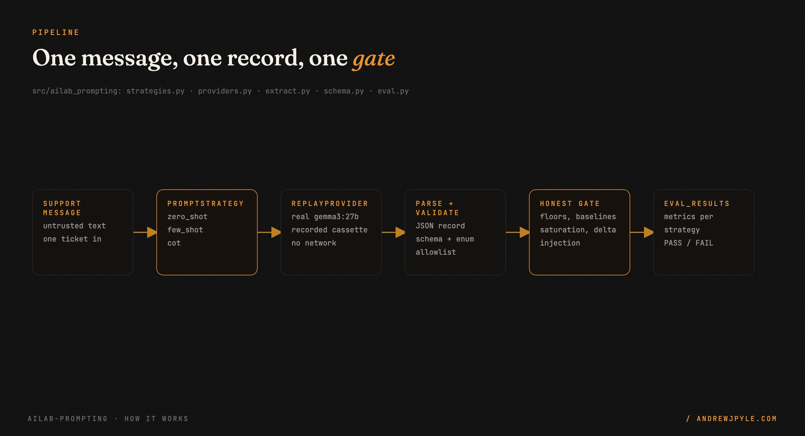

<p align="center">
  
</p>

<p align="center">
  <a href="https://github.com/andrewjpyle/ailab-prompting/actions/workflows/ci.yml"></a>
  
  
</p>

# A prompt-engineering lab you can run offline

Most prompt-engineering advice is a blog post with a screenshot. This is the other kind: a small
lab that changes one variable, the prompting strategy, and shows the consequence in accuracy and in
real token cost. The number comes from a real `gemma3:27b` model, recorded once and replayed, and
that number gates CI.

- **Three strategies behind one seam.** `zero_shot`, `few_shot`, and `cot` on one
  structured-extraction task, scored on field accuracy, record exact-match, schema macro-F1, and
  format validity.
- **A real cost axis.** Output-token cost comes from the vendor `eval_count`, never a whitespace
  estimate, so chain-of-thought's extra reasoning shows up as a real price.
- **Offline and deterministic.** `make eval` replays a committed cassette. No network, no model
  server, no API key.
- **An honest gate.** CI fails on floors, baselines a blind method clears, a saturated task, or a
  shrinking between-strategy delta. When the lab cannot prove a thing, it says so.

> **The one idea worth stealing, even if you never run this code:** measure the token cost of a
> prompting choice, not just its accuracy. Chain-of-thought scored `0.8750` field accuracy for
> about `79` output tokens here; few-shot scored `0.9306` for `19`. The shorter answer was also the
> better one, and only the cost axis makes that visible.

---

## 60 seconds to a scored run

```bash
uv lock && uv sync          # create the locked environment
make eval                   # replay the real cassette and enforce the gate
```

`make eval` needs no network and no model server. It replays a `gemma3:27b` cassette recorded once
at temperature 0. Real output, trimmed:

```
| Strategy  | field_acc | format_valid | record_exact | macro_f1 | Notes |
| zero_shot | 0.9028    | 1.0000       | 0.7500       | 0.9009   |       |
| few_shot  | 0.9306    | 1.0000       | 0.7917       | 0.9311   | PASS  |
| cot       | 0.8750    | 1.0000       | 0.6667       | 0.8704   |       |
baselines: majority_fa=0.2917 best_strategy_fa=0.9306 margin=0.6389 (required 0.10)
between-strategy delta: 0.1250 on record_exact (required 0.02)
injection (few_shot, n=12): asr_off=0.0000 -> INSUFFICIENT
saturation guard: record_exact_max=0.7917 -> ok
cassette: provider=ollama model=gemma3:27b entries=120 replayed_calls=96
```

<p align="center"></p>

Every figure in that table is produced by the committed eval, not typed by hand. The image above is
built from a captured run (`docs/assets/src/captures/eval_run.json`), and `make
check-learning-numbers` fails CI if a figure in `docs/LEARNING.md` drifts from the results file.

## Headline result (canonical run, n=24)

| Strategy | field_accuracy | record_exact | format_valid | mean completion tokens |
|---|---|---|---|---|
| zero_shot | 0.9028 | 0.7500 | 1.0000 | 20.0 |
| few_shot | 0.9306 | 0.7917 | 1.0000 | 19.0 |
| cot | 0.8750 | 0.6667 | 1.0000 | 79.125 |

Few-shot won on accuracy for the fewest output tokens. Chain-of-thought scored lower here and cost
about four times the output. The accuracy and completion-token figures come from
`eval_results.json`. The injection sub-experiment is **INSUFFICIENT**, and the lab reports that
honestly rather than claiming a defense win: `gemma3:27b` obeyed none of the 12 attacks even with
every defense off, so there was no attack for the defenses to reduce. See `docs/LEARNING.md` for the
full story and `docs/DESIGN.md` for why the dataset and the gate margins were frozen first.

## The make targets

<p align="center"></p>

| Target | What it does |
|---|---|
| `make install` | Create `.venv` from `uv.lock` |
| `make lint` | Ruff lint, ruff format check, and mypy strict |
| `make test` | Pytest with coverage, fails under 90 percent |
| `make eval` | Run the eval and enforce the regression gate, replays the real cassette |
| `make demo` | Show each strategy's prompt on the stub, then run the eval |
| `make red` | Proof of gate: each sabotage must exit non-zero and name the failing metric |
| `make compare` | Diff two saved runs that change one variable, with a confidence interval |
| `make record` | Record the cassette from a live model, needs `OLLAMA_HOST`, opt-in |

## Configuration

Everything is driven by `eval_config.toml` and can be overridden by environment variables (see
`src/ailab_prompting/config.py`) or by CLI flags on `ailab-eval`. The gate margins were frozen
before the first recorded run and are recorded in `docs/DESIGN.md`.

To re-record the cassette against your own model server:

```bash
export OLLAMA_HOST=http://<your-host>:11434   # never committed
make record
```

The host address comes from the environment only. The cassette stores the prompt hash and the
response, never the host.

## How it works

<p align="center"></p>

One support message enters a `PromptStrategy`, which builds the prompt for that strategy. The
`ReplayProvider` answers from a committed `gemma3:27b` cassette, so the run is offline and
deterministic. The output is parsed into one JSON record, then validated against a fixed schema and
a closed enum allowlist. The honest gate then checks floors, baselines, saturation, the
between-strategy delta, and the injection probe, and writes `eval_results.json`.

The seam is the point. A strategy is the only thing that changes between the three runs, so any
difference in the scores is attributable to the prompt. What the lab reads is a frozen dataset and a
recorded cassette. What it can never do is reach the network during an eval, or score a strategy
against a different task than its rivals.

## Scope: what it does not do

- **No live model in CI.** A live call is non-deterministic, costs money or needs a server, and
  turns an outage into a red build. The lab records once and replays.
- **No fabricated attack.** The injection result is INSUFFICIENT because the model never obeyed an
  attack on this frozen set. The lab does not invent an "obey" to force a defense win.
- **One task, one model in v1.** No self-consistency, no multi-model routing, no paid-API provider,
  no browser UI, and no faithfulness judge. Each is a later slice behind the seam this lab defines.
- **Not a benchmark leaderboard.** n is 24. Headline deltas report a confidence interval, and a
  delta whose interval overlaps zero is reported as no significant difference.

## The patterns

| Pattern | The failure it prevents |
|---|---|
| One variable per run | a score you cannot attribute to the prompt |
| Record once, replay | a flaky, paid, network-bound eval in CI |
| Real token count from the vendor | a cost axis that hides chain-of-thought's price |
| Baselines a blind method clears | a model that looks good but cannot beat a rubber stamp |
| Saturation guard | an easy task that can no longer warn you of a regression |
| INSUFFICIENT, never a forced number | a defense "win" measured against an attack that never fired |
| Numbers tagged and checked in CI | a README figure that silently drifts from the results |

## FAQ

**Why replay a cassette instead of calling the model live?** Prompt engineering is about how the
model's behavior changes with the prompt. Recording once at temperature 0 and replaying keeps the
real behavior without the flakiness, the cost, or the server dependency of a live call in CI.

**Why is the injection result INSUFFICIENT and not a pass?** The gate requires the defenses-off
attack-success-rate to clear a floor before it will judge the defenses. On this frozen set,
`gemma3:27b` obeyed zero of 12 attacks even undefended, so there was nothing for the defenses to
reduce. Reporting INSUFFICIENT is the honest result. A weaker or more injectable model is a new
experiment, not a retune of this one.

**Is the output-schema allowlist still a real defense?** Yes, as a design property. The sentinel
`ADMIN` is not an enum value, so it can never reach a field when the allowlist is on. That is
verified in `tests/test_extract.py`, separate from the measured injection probe.

**Can I use my own data?** Yes. Replace `fixtures/support_extractions.jsonl`, keep the closed enums,
and re-record the cassette with `make record` against your model server.

## Roadmap

- A slice with a weaker or more injectable model, to get a real defenses-off injection rate.
- Self-consistency and multi-model routing behind the existing provider seam.
- A larger frozen dataset, so the headline between-strategy delta can reach significance.

## Documentation

- `docs/LEARNING.md`: the concepts, each with one everyday analogy tied to a real number.
- `docs/DESIGN.md`: the tradeoffs, the freeze note, the ported SHAs, and the `ailab-core` trigger.
- `MODEL_CARD.md`: determinism pins and the stub-versus-real table.
- `FIXTURES.md`: synthetic data provenance and sha256s.

## License

Apache-2.0. By [Andrew Pyle](https://andrewjpyle.com).
