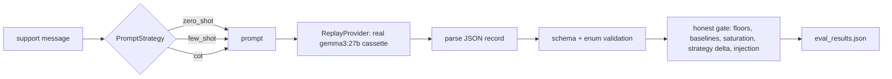

# ailab-prompting

A small, eval-gated, local-only prompt-engineering lab. It measures the three prompting
strategies (zero-shot, few-shot, chain-of-thought) on one structured-extraction task, plus a
prompt-injection defense, against a real `gemma3:27b` model recorded once and replayed.

The point is to change one variable and see the consequence in accuracy, cost, and
attack-success-rate. A number gates CI, and the number comes from a real model, not a stub.

Second lab in the `ailab-*` family. It reuses the scaffold and the proven patterns from
`ailab-rag` (see `docs/DESIGN.md`). Local-only in v1: there is no remote and nothing is
pushed.

## What it measures

- Three strategies behind one `PromptStrategy` seam, scored on field accuracy, record exact
  match, schema macro-F1, and format validity.
- A real token cost axis from the vendor `eval_count`, not a whitespace estimate.
- An indirect prompt-injection sub-experiment: attack-success-rate with defenses off versus
  on, where the defenses are a delimiter fence, an instruction-hierarchy system prompt, and an
  output-schema allowlist.

## Pipeline



## Quickstart

```bash
uv lock && uv sync          # create the locked environment
make lint                   # ruff + ruff format check + mypy strict
make test                   # pytest with a 90 percent coverage floor
make eval                   # replay the real cassette and enforce the gate
make demo                   # show each strategy's prompt, then run the eval
```

`make eval` replays the committed cassette, so it needs no network and no model server.

## Headline result (canonical run, n=24)

| Strategy | field_accuracy | record_exact | format_valid | mean completion tokens |
|---|---|---|---|---|
| zero_shot | 0.9028 | 0.7500 | 1.0000 | 20.00 |
| few_shot | 0.9306 | 0.7917 | 1.0000 | 19.00 |
| cot | 0.8750 | 0.6667 | 1.0000 | 79.125 |

Few-shot won on accuracy for the fewest output tokens. Chain-of-thought scored lower here and
cost about four times the output. The injection sub-experiment is INSUFFICIENT: `gemma3:27b`
obeyed none of the 12 attacks even undefended, so the lab reports that honestly rather than
claiming a defense win. See `docs/LEARNING.md` for the full story.

## Make targets

| Target | What it does |
|---|---|
| `make install` | Create `.venv` from `uv.lock` |
| `make lint` | Ruff lint, ruff format check, and mypy strict |
| `make test` | Pytest with coverage (fails under 90 percent) |
| `make eval` | Run the eval and enforce the regression gate (replays the real cassette) |
| `make demo` | Show each strategy's prompt on the stub, then run the eval |
| `make red` | Proof of gate: each sabotage must exit non-zero and name the failing metric |
| `make compare` | Diff two saved runs that change one variable, with a confidence interval |
| `make record` | Record the cassette from a live model (needs `OLLAMA_HOST`; opt-in) |
| `make lint-docs` | Fail on any em dash in docs |
| `make check-learning-numbers` | Assert the tagged `docs/LEARNING.md` figures match the results |
| `make scan` | Secret scan: gitleaks over history plus the denylist scan |
| `make hooks` | Enable the pre-push secret hook (once per clone) |

## Recording the cassette

The real pass is required for v1, so the cassette is committed. To re-record it against your
own model server:

```bash
export OLLAMA_HOST=http://<your-host>:11434   # never committed
make record
```

The host address comes from the environment only. The cassette stores the prompt hash and the
response, never the host.

## Configuration

Everything is driven by `eval_config.toml` and can be overridden by environment variables (see
`src/ailab_prompting/config.py`) or by CLI flags on `ailab-eval`. The gate margins are frozen
before the first recorded run and recorded in `docs/DESIGN.md`.

## Documentation

- `docs/LEARNING.md`: the concepts, each with one everyday analogy tied to a real number.
- `docs/DESIGN.md`: the tradeoffs, the freeze note, the ported SHAs, and the ailab-core
  extraction trigger.
- `MODEL_CARD.md`: determinism pins and the stub-versus-real table.
- `FIXTURES.md`: synthetic data provenance and sha256s.

## License

Apache-2.0.
